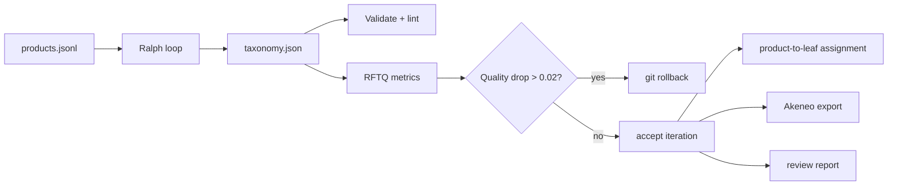

# hse_diploma

Code and experiment artifacts for the HSE master's thesis:

**Taxonomy Construction and Automated Quality Assessment via Iterative LLM-based Agent Pipelines**

[](LICENSE)
[](pyproject.toml)
[](CITATION.cff)

This repository contains a reproducible pipeline for building a product taxonomy from a raw product corpus when no seed taxonomy and no gold labels are available. The package name is `blind-taxonomy`; the repository name is `hse_diploma`.

The core idea is simple: treat the taxonomy as a versioned artifact. An LLM agent edits `taxonomy.json`, deterministic tools validate the structure, reference-free metrics score the result, and the orchestrator rolls back changes when quality drops.

## What Is Here

| Part | What it does |
|---|---|
| `taxonomy.json` | Production-candidate taxonomy artifact |
| `tools/metrics_v2.py` | CES, CSC, structural health, and RFTQ scoring |
| `tools/path_coherence.py` | RLPC path-coherence component |
| `tools/taxonomy_linter.py` | Deterministic checks for weak edges, wrappers, duplicates, and other taxonomy issues |
| `tools/assignment.py` | Product-to-leaf assignment with review flags |
| `tools/agent_judge.py` | Deterministic readiness review for the production candidate |
| `tools/akeneo_export.py` | CSV, XLSX, and REST-style JSON export for Akeneo PIM |
| `tools/reporting.py` | One review report that pulls together metrics, assignment, linter, judge, and export status |

## Pipeline



## Metric Layer

The thesis reports `RFTQ-J`, a within-study reference-free utility score:

```text
RFTQ-J =
    0.30 * CES
  + 0.20 * CSC
  + 0.25 * RLPC
  + 0.15 * Judge
  + 0.10 * Struct
```

The components are intentionally reported separately. A single score is useful for rollback, but it is not treated as a universal probability of taxonomy correctness.

| Component | Meaning |
|---|---|
| CES | Parent-child edge validity through embedding cosine similarity |
| CSC | Agreement between semantic similarity and graph structure |
| RLPC | Root-to-leaf path coherence: monotonicity, step coherence, and path-level proxy |
| Judge | LLM-as-judge path rating, reported as an auxiliary axis |
| Struct | Structural health penalty for wrapper chains and branching pathologies |

## Main Result Snapshot

| Method | CES | CSC | RLPC | Judge | RFTQ-J | Weak edges | Linter errors |
|---|---:|---:|---:|---:|---:|---:|---:|
| Naive one-pass | 0.535 | 0.236 | 0.707 | 4.66 | 0.614 | 19 | 19 |
| CoL-light | 0.530 | 0.258 | 0.682 | **4.78** | 0.613 | 16 | 16 |
| Ralph Exp. 7 | **0.620** | **0.491** | 0.761 | 4.64 | **0.714** | 1 | 1 |
| Ralph Exp. 10 | 0.599 | 0.459 | 0.745 | 4.74 | 0.691 | **0** | **0** |

Experiment 7 is the research winner by RFTQ-J. Experiment 10 is the deployment candidate because it has zero weak edges and zero blocking linter errors.

The CoL-light baseline is a simplified inline replication of Chain-of-Layer and does not include the original Ensemble Ranking Filter, so the comparison is intentionally scoped.

## Quick Start

```bash
git clone https://github.com/iamverk/hse_diploma.git
cd hse_diploma

python -m venv .venv
source .venv/bin/activate
pip install -e ".[dev,pim]"
```

## Common Commands

```bash
python tools/validate.py taxonomy.json
python tools/metrics_v2.py taxonomy.json --json
python tools/path_coherence.py taxonomy.json --json
python tools/taxonomy_linter.py taxonomy.json
python tools/assignment.py data/products.jsonl taxonomy.json --out artifacts/local/product_assignments.csv
python tools/akeneo_export.py taxonomy.json --xlsx
python tools/reporting.py
```

Package entry points are also available after installation:

```bash
blind-tax-validate taxonomy.json
blind-tax-metrics taxonomy.json
blind-tax-paths taxonomy.json
blind-tax-lint taxonomy.json
blind-tax-akeneo taxonomy.json --xlsx
```

## Experimental Scope

The thesis evidence is deliberately bounded:

- one frozen 1,500-record sample from Amazon ESCI;
- one construction model setup;
- one construction-time embedder, with a post-hoc cross-embedder probe;
- automatic judge signals, with a second-model audit for the deployment candidate;
- CoL-light rather than a full Chain-of-Layer reproduction.

That scope is part of the claim. The repository demonstrates an auditable workflow for one blind product-taxonomy setting; it does not claim universal generalization across all corpora, product domains, and model families.

## Citation

```bibtex
@mastersthesis{makarenkova2026taxonomy,
  author = {Makarenkova, Vera},
  title  = {Taxonomy Construction and Automated Quality Assessment via Iterative LLM-based Agent Pipelines},
  school = {HSE University},
  year   = {2026}
}
```

See [CITATION.cff](CITATION.cff) for the machine-readable citation metadata.

## License

MIT. See [LICENSE](LICENSE).
